# Kafka → Delta Lake → Azure OpenAI Intelligence Pipeline

A production-style streaming data engineering project that ingests clickstream events from Kafka, processes them with PySpark Structured Streaming, stores them in Delta Lake, and applies MLflow-tracked anomaly detection for Gold-layer scoring.

I built this project to practice the kinds of tradeoffs that show up in real streaming systems: checkpointing, observability, write performance, and making downstream outputs reliable enough to use.


## Live Project

This project is also published as a static site with diagrams, screenshots, notebook previews, and a walkthrough.

- [**Explore the Full Project Website**](https://kafka-delta-pipeline.andreahayes-dev.com/)

---

## Architecture

This pipeline simulates a real-time clickstream analytics system in which user events are streamed from Kafka, persisted to Bronze and Silver Delta tables, and then scored into Gold outputs using an MLflow-registered anomaly detection model.

### End-to-End Flow

This diagram shows the end-to-end Kafka → Delta Lake pipeline, including MLflow-based Gold-layer scoring.

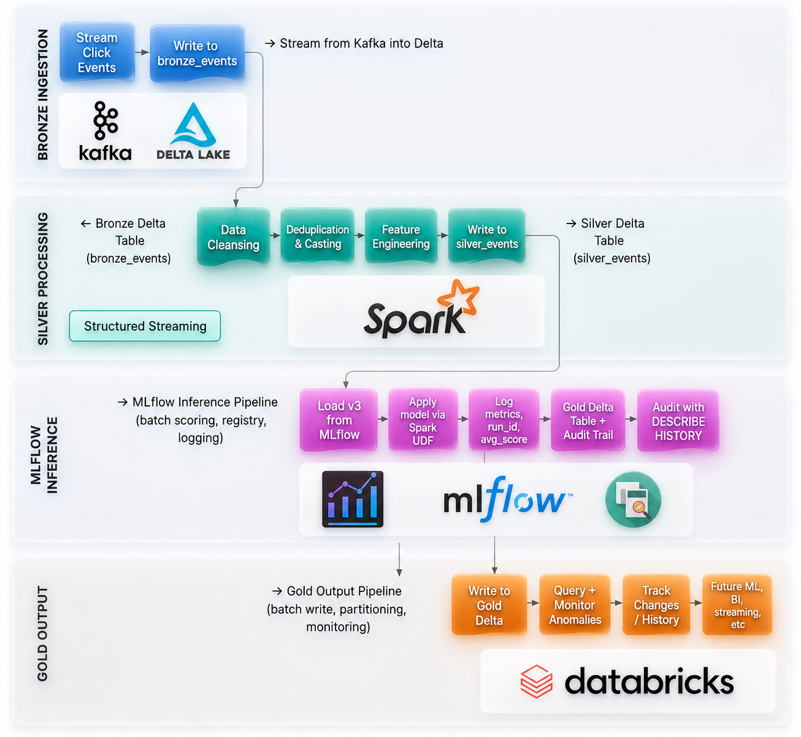
---

* * * * *

## Key Engineering Highlights

This project highlights several production-minded engineering patterns:

-   build a **real-time streaming pipeline** with Kafka and PySpark Structured Streaming
-   use **Delta Lake** for transactional Bronze, Silver, and Gold storage
-   implement **checkpointing and replayability** for fault tolerance
-   orchestrate end-to-end execution with **Databricks Workflows**
-   add **monitoring, benchmarking, and cluster usage tracking**
-   inspect **Spark UI and physical plans** for performance tuning
-   integrate **MLflow model logging, registry, and batch inference**
-   produce auditable Gold outputs with anomaly scores and inference metadata

* * * * *

## Core Stack

| Area | Technology |
| --- | --- |
| Streaming | Confluent Kafka |
| Processing | PySpark Structured Streaming |
| Storage | Delta Lake on Databricks |
| Orchestration | Databricks Workflows |
| Monitoring | Delta log tables, Spark UI, benchmark logs |
| ML | scikit-learn Isolation Forest, MLflow |
| Hosting | AWS S3, CloudFront, Route 53 |
| AI Enrichment | Azure OpenAI, GPT-4.1-mini, Pydantic structured outputs |
| AI Evaluation | MLflow Tracking, Delta Lake |
| RAG          | Knowledge Base, Retrieval-Augmented Generation |
| Human Review | Human-in-the-Loop Workflow                     |


* * * * *

## Workflow Orchestration

One of the main goals here was not just to move events from Kafka to Delta, but to make the pipeline easier to monitor and reason about once it was running.

The full pipeline is orchestrated through **Databricks Workflows** using a chained job called `full_streaming_pipeline`.

### Task Flow

1.  `01_stream_kafka_to_bronze` -- ingests Kafka events into Bronze
2.  `02_bronze_to_silver_cleanse` -- parses, deduplicates, and writes Silver
3.  `03_monitor_silver_events` -- tracks late events and stream freshness

DAG config: [`jobs/full_streaming_pipeline.json`](jobs/full_streaming_pipeline.json)

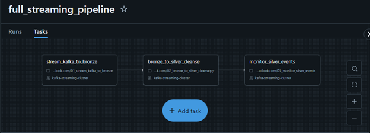

* * * * *

## Layer Design

### Bronze

The Bronze layer captures raw streaming events from Kafka and persists them to Delta Lake.

Key behaviors:

-   structured streaming ingestion from Confluent Kafka
-   binary payload parsing into structured JSON
-   append-mode Bronze writes
-   checkpointing for replayability and fault tolerance

### Silver

The Silver layer cleanses and deduplicates Bronze data into a curated current-state dataset.

Key behaviors:

-   event parsing and normalization
-   deduplication and write optimization
-   performance inspection with Spark UI and physical plans

### Gold

The Gold layer stores anomaly-scored events and predictions for downstream analytics.

Key outputs:

-   `gold_anomaly_predictions`
-   `gold_events_scored`
-   anomaly scores and flags
-   inference metadata including MLflow run linkage

* * * * *

## Screenshots

### Workflow DAG


This DAG runs ingestion → transformation → monitoring through chained Databricks Workflow tasks.

### Monitor Logs
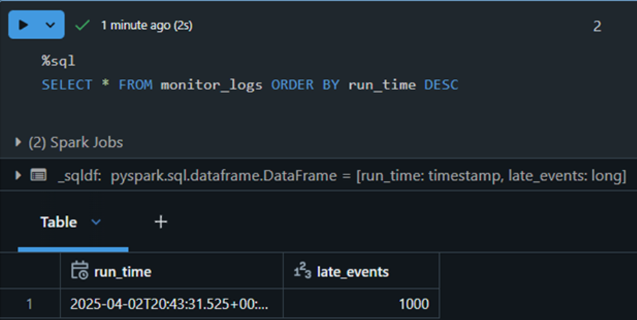

The pipeline records late/stale event metrics into `monitor_logs` for stream observability.

### Benchmark Logs
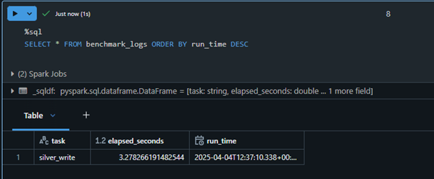

Key transformation runtimes are logged to `benchmark_logs` to support performance benchmarking.

### Spark UI: Silver Write
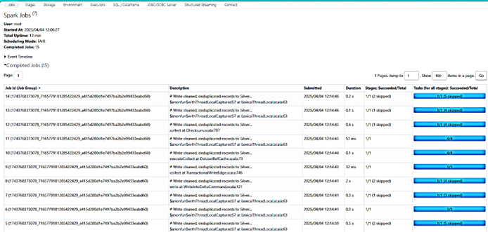

Spark UI inspection was used to benchmark and optimize the Silver write stage. 

### MLflow Model Registry
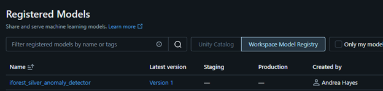

The anomaly detection model is logged and registered in MLflow for reproducible scoring and lifecycle management.

### Gold Delta Output
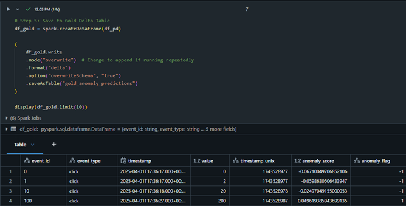

Gold outputs store anomaly predictions and scored events for downstream exploration.

* * * * *

## Observability and Performance

The pipeline includes multiple observability layers to simulate production-minded streaming operations.

I wanted this project to go beyond “it runs” by looking at how the Silver write actually behaved in Spark and logging runtimes for repeatable comparison.

### Stream monitoring

Late and stale events are logged to the `monitor_logs` Delta table:


```sql
SELECT *
FROM monitor_logs
ORDER BY run_time DESC;
```

### Cluster usage tracking

Manual cluster usage is logged to `cluster_logs` for cost awareness:

```sql
SELECT *
FROM cluster_logs
ORDER BY end_time DESC;
```

### Benchmarking

Transformation runtimes such as Silver writes are logged to `benchmark_logs`:

```sql
SELECT *
FROM benchmark_logs
ORDER BY run_time DESC;
```

### Spark physical plan inspection

The Silver transformation was inspected with:

```python
df_deduped.explain(mode="formatted")
```

This helped validate and optimize the write path before persisting to `silver_events`.

* * * * *

## ML Inference and Anomaly Detection

This project uses an **Isolation Forest** model to score curated Silver events and write anomaly predictions into Gold Delta tables.

Rather than treat ML inference as a separate demo, I wanted the scoring step to feel like part of the pipeline itself, with tracked runs, registered models, and reproducible outputs.

### Highlights

-   trained on `value` and `timestamp_unix`
-   logged to MLflow with input signature and parameters
-   registered in MLflow Model Registry
-   scored 1,000+ Silver events
-   produced:
    -   `anomaly_score`
    -   `anomaly_flag`
-   wrote outputs to:
    -   `gold_anomaly_predictions`
    -   `gold_events_scored`

### Example Gold query

```sql
SELECT *
FROM gold_anomaly_predictions
WHERE anomaly_flag = -1
ORDER BY anomaly_score ASC
LIMIT 20;
```

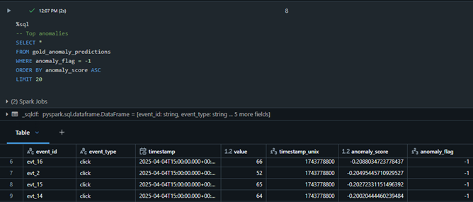

* * * * *

## Why the MLflow Integration Matters

This project does more than attach a model to a pipeline. It demonstrates:

-   reproducible model logging
-   versioned model registration
-   tracked batch inference runs
-   auditable scoring outputs
-   linkage between inference results and MLflow run metadata

That makes the Gold layer more credible as a production-style ML-ready output rather than a one-off demo.

* * * * *

## AI Enrichment Layer: Azure OpenAI Structured Outputs

After the traditional ML anomaly detection step, I added a production-grade Generative AI layer using Azure OpenAI. This transforms raw anomaly scores into rich, explainable, and actionable insights.

After anomalous events are written to `gold_anomaly_predictions`, a Databricks notebook calls a deployed Azure OpenAI `gpt-4.1-mini` model to generate structured explanations for each anomaly.

## AI Intelligence Layer

This diagram shows the AI intelligence layer, including Azure OpenAI enrichment, retrieval-augmented generation (RAG), human review workflows, business impact analysis, and operational decision support.

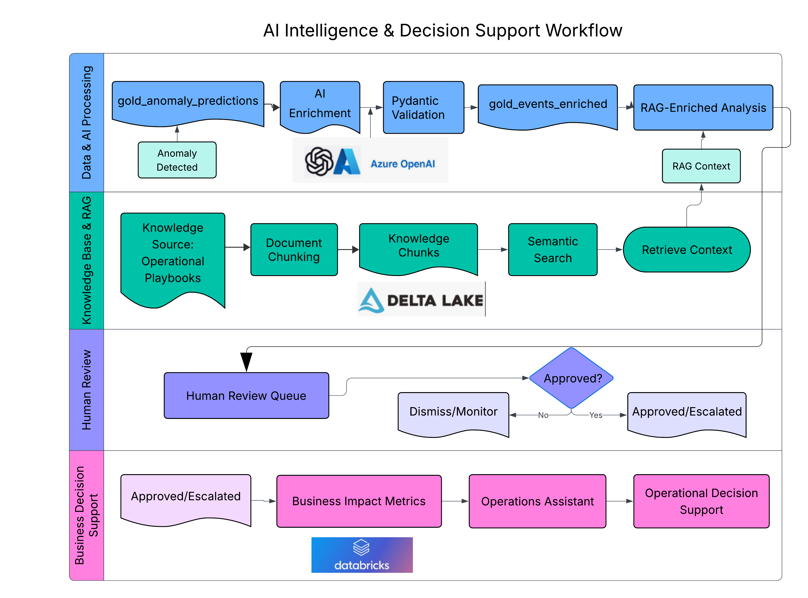

### Enrichment Output

The AI layer produces structured fields including:

-   `event_summary`

-   `user_intent`

-   `risk_level`

-   `risk_explanation`

-   `confidence`

-   `structured_output_valid`

-   `llm_model`

-   `prompt_version`

-   `enrichment_ts`

### Azure OpenAI Enrichment Screenshots

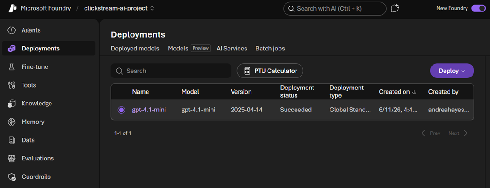

The Azure OpenAI deployment hosts the GPT-4.1-mini model used to generate structured anomaly explanations and risk assessments.

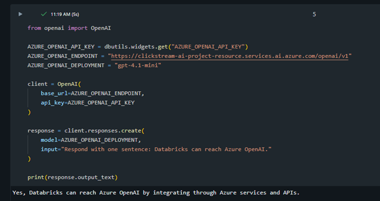

Databricks successfully connects to Azure OpenAI and executes inference requests as part of the enrichment workflow.

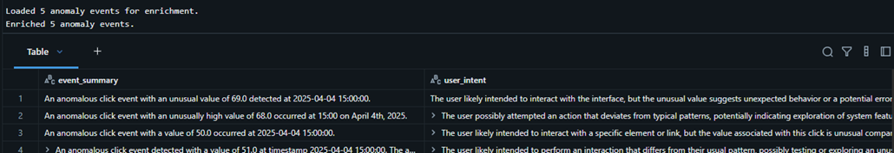

AI-generated event summaries and inferred user intent are persisted to the `gold_events_enriched` Delta table for downstream analysis.

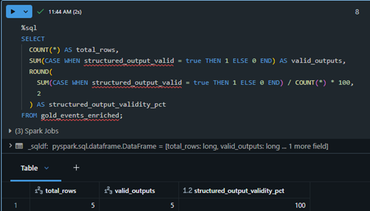

Pydantic validation is used to verify structured AI responses, achieving 100% validity across the initial enrichment sample.

### AI Risk Assessment Output

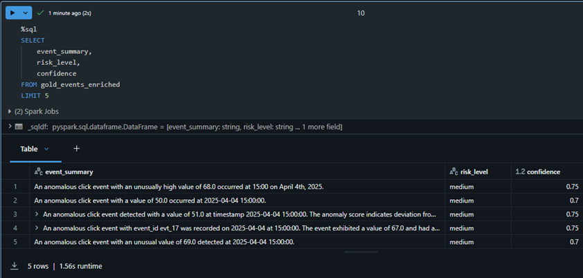

Structured outputs include AI-generated risk levels and confidence scores for downstream analyst review.

* * * * *

## AI Evaluation and Prompt Tracking

To make the AI enrichment layer observable and auditable, the project includes a dedicated evaluation workflow that measures structured output quality and logs operational metadata.

### Evaluation Flow

gold_events_enriched
        ↓
Structured Output Validation
        ↓
MLflow Experiment Tracking
        ↓
ai_enrichment_eval_metrics

### Evaluation Metrics

The evaluation workflow records:

- total enriched rows
- valid structured outputs
- structured output validity percentage
- confidence metrics
- model version
- prompt version
- runtime metadata

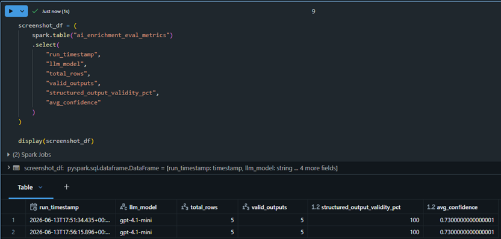

Evaluation results are persisted to the `ai_enrichment_eval_metrics` Delta table, creating an auditable history of AI enrichment quality, confidence scores, prompt versions, and model performance over time.

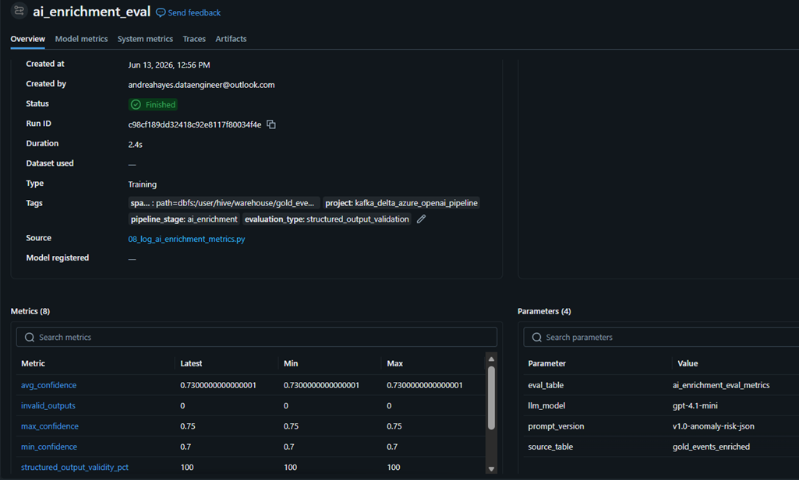

MLflow tracks enrichment evaluation runs, including structured output validity, confidence metrics, runtime measurements, model version, and prompt version for future experimentation and comparison.

* * * * *

## Retrieval-Augmented Generation (RAG)

The project now includes a Retrieval-Augmented Generation (RAG) investigation layer that provides historical incident context and operational playbooks to Azure OpenAI during anomaly enrichment.

### RAG Workflow

gold_anomaly_predictions
        ↓
knowledge_chunks
        ↓
Dynamic Retrieval
        ↓
Azure OpenAI GPT-4.1-mini
        ↓
gold_events_enriched_rag

### Knowledge Base

The RAG layer includes operational knowledge documents such as:

- payment_processor_outage_2024.md
- cdn_latency_incident_2024.md
- checkout_abandonment_playbook.md
- fraud_response_playbook.md

These documents are chunked and stored in the knowledge_chunks Delta table for retrieval.

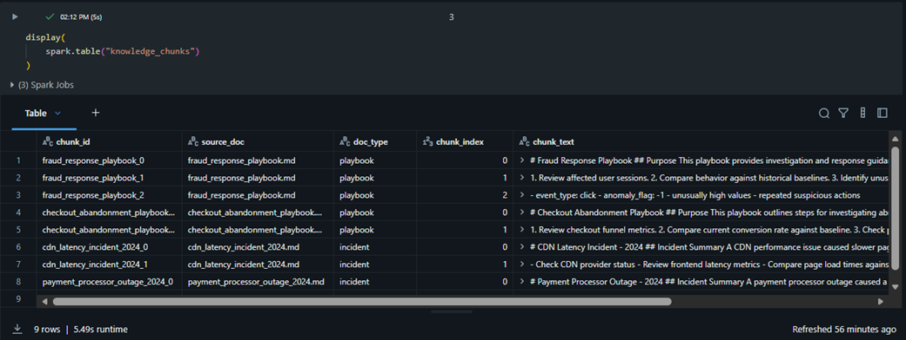

Operational incident reports and playbooks are chunked and stored in the knowledge_chunks Delta table for retrieval during RAG-based anomaly investigation.

### RAG Output Fields

The RAG enrichment workflow extends the original AI enrichment output with:

- related_incident
- recommended_action
- source_document

This enables anomaly explanations to reference operational guidance and historical incident context.

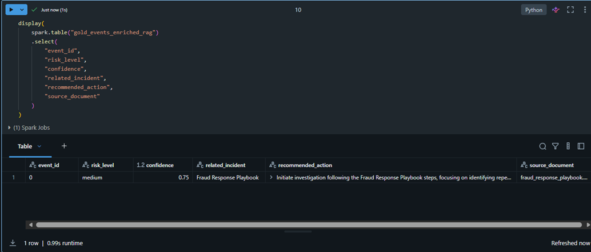

The RAG enrichment workflow combines anomaly data with retrieved operational context to generate incident-aware recommendations, source attribution, and analyst guidance.

* * * * *

## Human Review Queue

To support human-in-the-loop operations, RAG-enriched anomalies are routed into a review workflow.

### Human Review Flow

gold_events_enriched_rag
        ↓
human_review_queue
        ↓
approved / escalated / dismissed

### Review Metadata

The review queue records:

- review_id
- review_status
- review_priority
- reviewer_notes
- reviewed_by
- review_created_ts
- reviewed_ts

This creates an auditable workflow that combines AI recommendations with human analyst oversight.

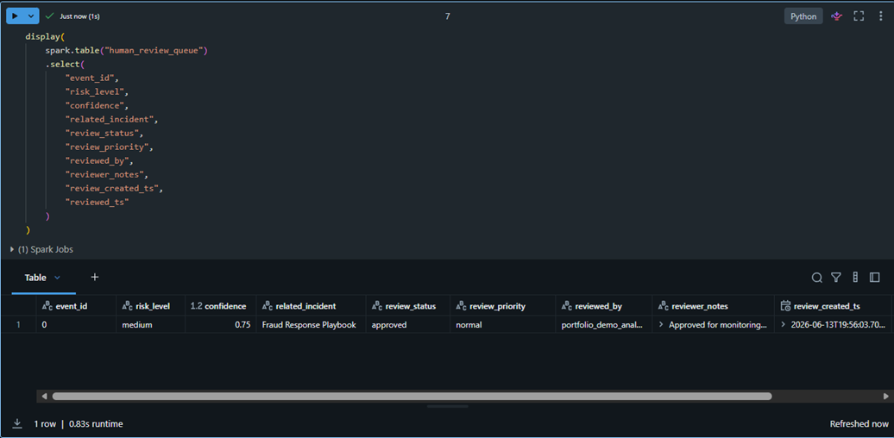

RAG-enriched anomalies are routed into a human review workflow, enabling analyst approval, escalation, and auditability of AI-generated recommendations.

* * * * *

## Business Impact Simulation

The platform converts AI and RAG-enriched anomaly findings into business-oriented metrics that help prioritize operational response efforts.

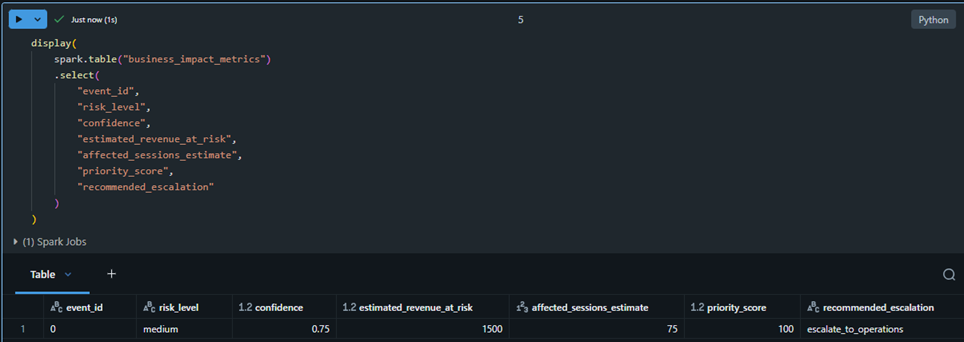

AI and RAG-enriched anomaly findings are translated into estimated revenue at risk, affected session estimates, priority scores, and recommended escalation actions.

### Business Impact Outputs

- Estimated revenue at risk
- Affected session estimates
- Priority scoring
- Recommended escalation actions


AI and RAG-enriched anomaly findings are translated into estimated revenue at risk, affected session estimates, priority scores, and recommended escalation actions.

* * * * *

## Semantic Search

The knowledge base is vectorized using TF-IDF embeddings and cosine similarity to retrieve the most relevant incidents and operational playbooks for a given query.

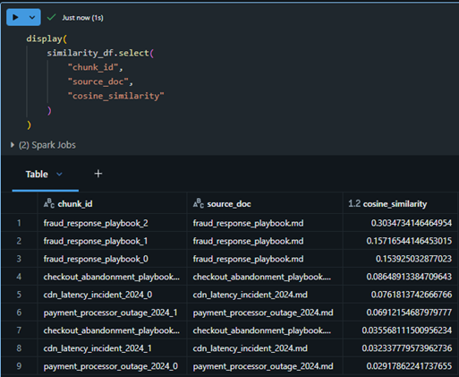

Knowledge base documents are vectorized using TF-IDF embeddings and ranked using cosine similarity, allowing relevant incident reports and playbooks to be retrieved based on natural language queries.

* * * * *

## Cost and Infrastructure Optimization

I included cost and cluster tracking because in real data platforms, performance is only half the story - how much a workflow costs to run matters too.

This project includes several practical cost/performance controls:

-   **spot instances + auto-termination** on Databricks clusters
-   **cluster usage logging** for cost visibility
-   **benchmark logging** for transformation timing
-   **partitioning and ZORDER** for query efficiency

These choices help simulate a more realistic production environment. 

## Sample Kafka Event

```json
{
  "event_id": "997",
  "event_type": "click",
  "timestamp": "2025-04-01T17:37:57.000Z",
  "value": "1984"
}
```

* * * * *

## Certification Alignment

This project aligns with Databricks Data Engineer Professional and AI-103 Azure AI Apps and Agents Developer Associate certification topics including:

- Structured Streaming
- Delta Lake medallion architecture
- Databricks workflow orchestration
- production-minded observability and monitoring
- MLflow model logging, registry, and inference
- performance tuning and Spark execution inspection
- Azure OpenAI model deployment
- structured outputs with Pydantic validation
- AI-powered anomaly explanation and risk assessment
- responsible AI patterns including validation, confidence scoring, and auditability