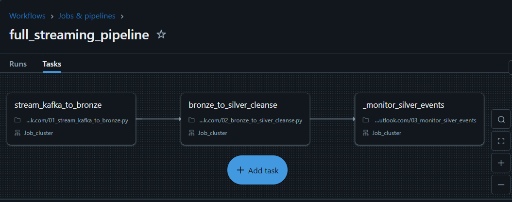
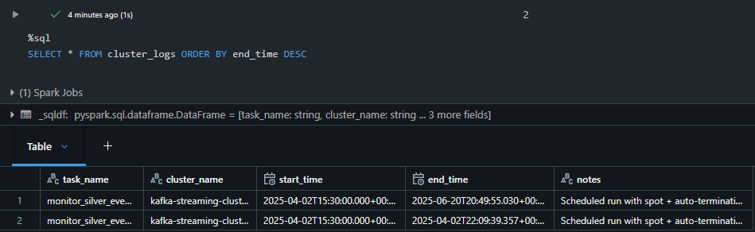
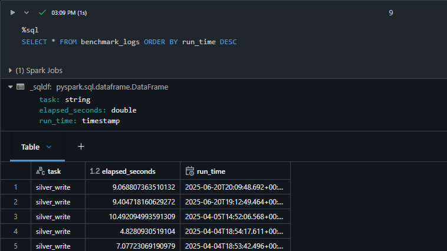
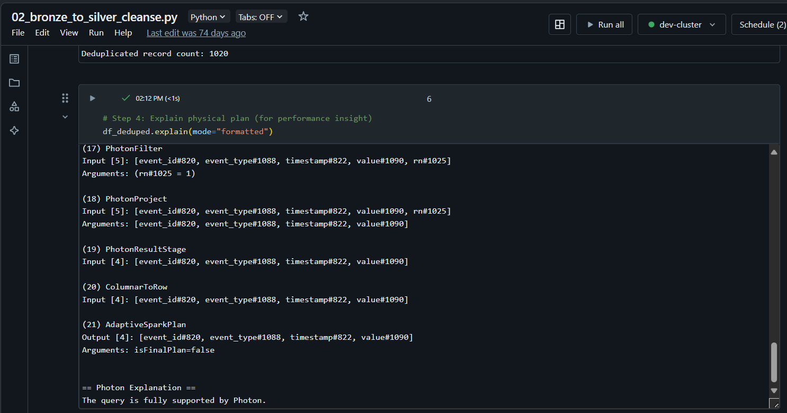
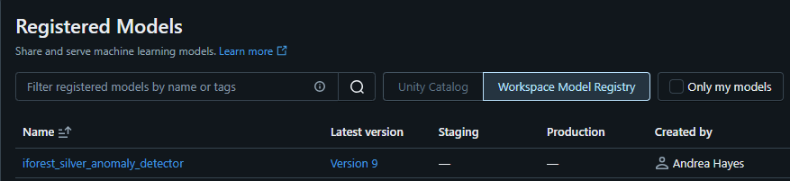
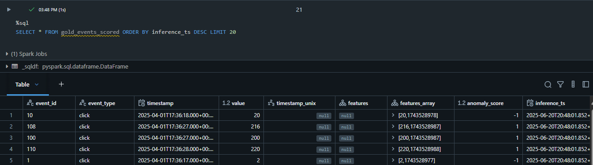
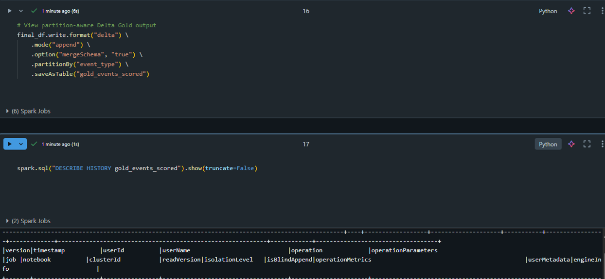

# Kafka → Delta Lake Streaming Pipeline (Databricks)

A real-time, cloud-native data engineering pipeline that ingests, processes, and stores structured event data using Kafka, PySpark, and Delta Lake — purpose-built for portfolio demonstration and Databricks Professional certification prep.

## Tech Stack


## Project Website 
The project website is hosted on AWS S3 using static site hosting, fronted by CloudFront for performance and HTTPS support, and configured with Route 53 for a custom domain.

- Static Hosting via S3  
- CloudFront with HTTPS (SSL certificate)  
- Route 53 for domain and DNS routing

For more detailed information, please visit the [project website](https://kafka-delta-pipeline.andreahayes-dev.com/).

🎥 [**Watch the Video Walkthrough**](https://kafka-delta-pipeline.andreahayes-dev.com/video.html)

## End-to-End Flow

Confluent Kafka → PySpark Structured Streaming → Bronze Delta Table → Silver Layer → MLflow Inference → Gold Table


**Diagram:** End-to-end architecture of the Kafka-to-Delta streaming pipeline with MLflow integration for batch inference.  


## Contents
- [Project Overview](#project-overview)
- [End-to-End Flow](#end-to-end-flow)
- [Architecture](#architecture)
- [Features Implemented (Sprint 1)](#features-implemented-sprint-1)
- [Workflow Orchestration (Databricks Workflows)](#workflow-orchestration-databricks-workflows)
- [Engineering Insights](#engineering-insights)
- [Performance & Observability](#performance-optimization-spark-ui)
- [Write Performance Benchmarking](#write-performance-benchmarking)
- [Spark Physical Plan](#spark-physical-plan)
- [ML Inference & Anomaly Detection](#ml-inference--anomaly-detection)
- [Inference Results & Output Layer](#inference-results--output-layer)
- [Cost Optimization](#cost--infra-optimization-sprint-4–5)
- [Project Structure](#project-structure)
- [Certification Alignment](#certification-alignment)


## Architecture

This pipeline simulates a real-time ETL system using:
- Kafka (Confluent Cloud) for streaming ingestion
- PySpark Structured Streaming for real-time processing
- Delta Lake (Databricks) for transactional storage
- Databricks Workflows for orchestration


## Features Implemented (Sprint 1)

- Ingests synthetic events from Confluent Cloud Kafka
- Parses raw Kafka binary payloads into structured JSON
- Writes real-time data to Bronze Delta Table (append mode)
- Uses checkpointing for fault tolerance and replayability
- Kafka credentials redacted using `.env.template` or secrets
- Professionally annotated code with inline documentation

## Workflow Orchestration (Databricks Workflows)

This pipeline is fully orchestrated using [Databricks Workflows](https://docs.databricks.com/workflows/index.html), 
automating the complete flow from Kafka ingestion to data quality monitoring.

Orchestrated Job Name: `full_streaming_pipeline`

It includes the following chained tasks:

1. `01_stream_kafka_to_bronze` – reads real-time events from Kafka and writes to a Delta Bronze table  
2. `02_bronze_to_silver_cleanse` – parses, deduplicates, and optimizes data into the Silver layer  
3. `03_monitor_silver_events` – monitors stream freshness and logs late events for observability

You can also explore the DAG config here: [`jobs/full_streaming_pipeline.json`](jobs/full_streaming_pipeline.json)


File path:

```bash
jobs/full_streaming_pipeline.json
``` 

## Workflow DAG (Databricks Workflows)

This streaming pipeline is orchestrated via Databricks Workflows.

Job: `full_streaming_pipeline`

**Orchestration DAG: Kafka to Delta pipeline via Databricks Workflows**
This DAG executes ingestion → transformation → monitoring with job task chaining.




## Engineering Insights

In addition to building the streaming pipeline, the following enhancements were made to simulate real-world production observability and performance tuning.


## Streaming Observability

This pipeline logs late/stale event metrics to a Delta table called `monitor_logs`.

You can inspect this table using:

```sql
SELECT * FROM monitor_logs ORDER BY run_time DESC
```


*Sample Output: `monitor_logs` Delta Table*


## Cluster Usage Tracking (Cost Control)

This pipeline logs manual cluster usage into a Delta table called `cluster_logs` for observability and cost awareness.

```sql
SELECT * FROM cluster_logs ORDER BY end_time DESC
```

  
*Sample Output: cluster_logs Delta Table for task-level resource tracking*


## Performance Optimization (Spark UI)

This pipeline was benchmarked and optimized using the Spark UI and physical plans.

### Job-Level Execution Overview

  
*Spark UI job overview for the silver write benchmarking step.*

### Stage-Level Insight: Silver Write Task

  
*Stage-level Spark UI view showing I/O and task distribution for the silver write operation.*


## Write Performance Benchmarking 

This project logs the runtime of key transformations (like Silver writes) to a Delta table called `benchmark_logs`.

```sql
SELECT * FROM benchmark_logs ORDER BY run_time DESC
```


**Sample Output:** `benchmark_logs` table showing runtime duration for the `silver_write` task.


## Spark Physical Plan

This project uses Spark’s physical plan inspection to understand and optimize the Silver layer transformation.

Output of `df_deduped.explain(mode="formatted")` before writing to `silver_events`:



## ML Inference & Anomaly Detection

This stage uses an Isolation Forest model (via `scikit-learn`) to detect anomalies in curated Silver Delta Lake events. Inference results are stored in the Gold layer and visualized.

---

### Pipeline Highlights

- Trained `IsolationForest` on features: `value`, `timestamp_unix`
- Logged model to MLflow (with input signature)
- Tracked parameters (`contamination`, `features`) and training record count
- Registered model in MLflow Model Registry
- Scored over 1,000 Silver events and generated:
  - `anomaly_score`: continuous score
  - `anomaly_flag`: binary (`-1` = anomaly, `1` = normal)
- Wrote results to `gold_anomaly_predictions` and `gold_events_scored` Delta tables

---

### MLflow Model Logging

The trained model was logged to MLflow with:

- Input signature via `input_example`
- Parameters: contamination rate, feature names
- Metric: number of training records
- Registered in MLflow for versioned lifecycle management

**Model Name:** `iforest_silver_anomaly_detector`  
**Version:** 1  
**Registry Scope:** Workspace  
**Owner:** Andrea Hayes


---

### 🧾 MLflow Model Registry

This project uses the **MLflow Model Registry** to manage lifecycle stages of trained models.

The Isolation Forest model (`iforest_silver_anomaly_detector`) is logged and registered with:

- **Version control** (e.g. Version 1)
- **Owner metadata**
- **Workspace-level visibility**

This registry entry enables reproducible scoring, auditing, and deployment to other environments.

  
**Sample Output:** MLflow registry UI showing the registered Isolation Forest model and its version metadata.

---

### 📈 MLflow Tracking – Batch Inference

This MLflow run captures metrics, parameters, and artifacts logged during the Silver → Gold scoring pipeline. It tracks the input schema, average anomaly score, and links directly to the registered model.

  
**Sample Output:** MLflow run UI showing metadata, parameters, and source notebook used for inference.

---

### 📊 MLflow Tracked Metrics

MLflow metrics for the batch inference run (`Batch Inference: Silver to Gold`):

- **1020 events scored**
- **Average anomaly score: 0.80**

These metrics are automatically logged and versioned for every pipeline run, enabling reproducibility, performance tracking, and model monitoring.


---

### Sample Inference Output

This preview shows scored user interaction events from the Silver table. Anomaly scores are generated via an Isolation Forest model logged and deployed with MLflow.


---

### Inference Results & Output Layer


#### Gold Delta Table

  
**Sample Output:** A preview of the `gold_anomaly_predictions` Delta table with anomaly scores and flags.


#### Top Anomaly Query

```sql
SELECT * 
FROM gold_anomaly_predictions 
WHERE anomaly_flag = -1 
ORDER BY anomaly_score ASC 
LIMIT 20
```

  

**Sample Output:** Top 20 most anomalous events scored by the Isolation Forest model.


#### Anomaly Score Distribution

  
**Sample Output:** Distribution of Isolation Forest anomaly scores — left tail indicates flagged outliers.


#### Gold Table Output – Scored Events



Final output written to the `gold_events_scored` Delta table using Structured Streaming.

Includes event ID, type, timestamp, and original value — enriched with MLflow-inferred anomaly scores.

Partitioned by `event_type` and includes metadata such as `inference_ts` and `mlflow_run_id` (not shown).


#### Anomaly Detection Visuals

Confusion matrix and anomaly score distribution from Isolation Forest predictions.  
Threshold-based labeling enables binary classification from unsupervised scores.


### Delta Gold Table + Audit History

The ML inference results are written to a partitioned Delta table called `gold_events_scored`.  
This screenshot highlights how **Delta Lake tracks full lineage and version history** using:

- `anomaly_score` output  
- Inference timestamp  
- Associated `mlflow_run_id` for reproducibility

The `DESCRIBE HISTORY` command provides **auditable tracking** of every write, including the operation, user, and schema evolution.




<pre> 

## Project Structure

kafka-delta-streaming-pipeline/
├── bronze/
│   └── 01_stream_kafka_to_bronze.py
├── silver/
│   ├── 02_bronze_to_silver_cleanse.py
│   └── 03_monitor_silver_events.py
├── gold/
│   ├── 05_batch_inference_to_gold.py
│   └── 06_mlflow_inference_logging.py
├── utils/
│   ├── kafka_schema.py
│   └── log_cluster_activity.py
├── config/
│   └── .env.template
├── data/
│   └── synthetic_data_sample.json
├── jobs/
│   └── full_streaming_pipeline.json
├── docs/
│   ├── README_notes.md
│   └── [Screenshots + Diagrams]
├── .gitignore
└── README.md


 </pre>

## Sample Kafka Event

{
  "event_id": "997",
  "event_type": "click",
  "timestamp": "2025-04-01T17:37:57.000Z",
  "value": "1984"
}

## Roadmap

### Sprint 1 (Streaming Pipeline Foundations)
* Kafka cluster + producer simulation
* Bronze ingestion pipeline with Delta
* Silver table with filtering and deduplication
* Delta optimization (ZORDER, partitions)

### Sprint 2–4 (Advanced Layers and Inference)
* MLflow model training and tracking
* Batch inference to Gold layer
* Spark tuning and cost control
* Final repo cleanup, documentation, and demo video

## Cost + Infra Optimization (Sprint 4–5)

To simulate cloud-scale engineering and cost-awareness, this project includes:
- Spot instances + auto-termination on Databricks clusters
- Logging cluster usage to Delta (`cluster_logs`)
- Lightweight benchmarking to track performance (`benchmark_logs`)
- Partitioning + ZORDER to reduce query cost

This mirrors best practices used in production streaming systems.


## Certification Alignment

This project is built to align with the Databricks Certified Data Engineer Professional exam covering:
* Structured Streaming
* Delta Lake intricacies
* Production-level best practices
* Advanced MLflow integration