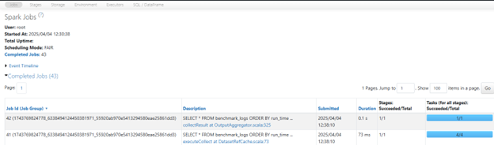
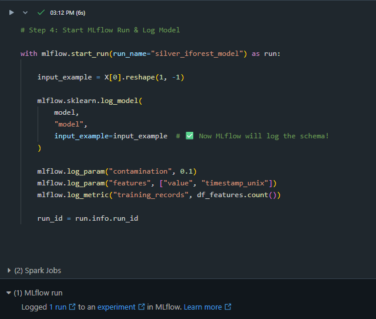
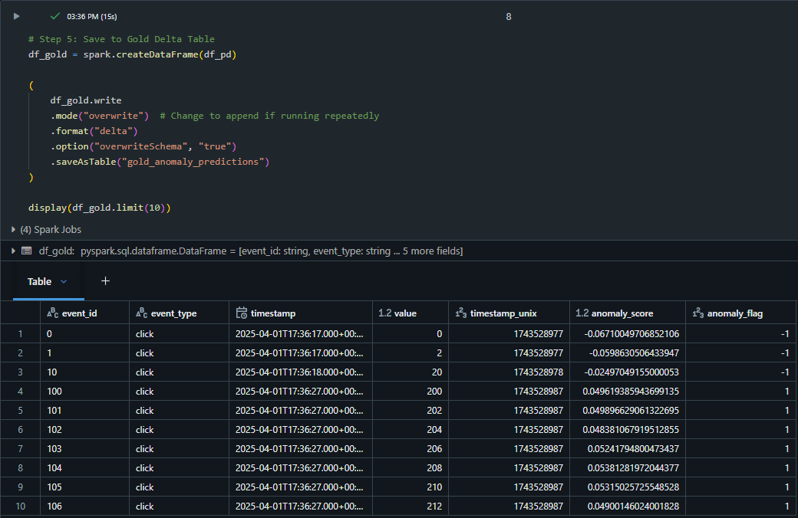
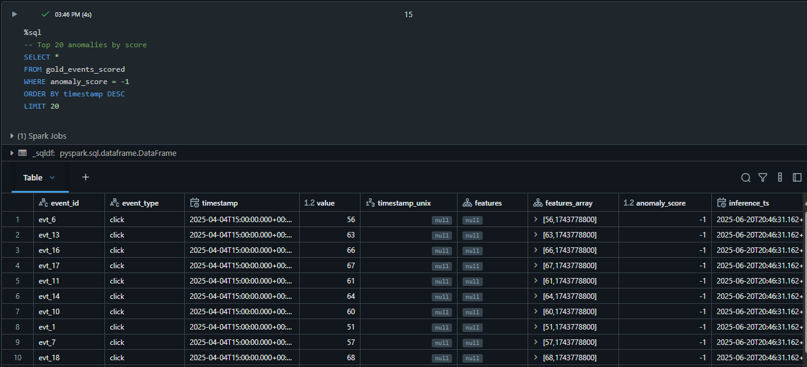
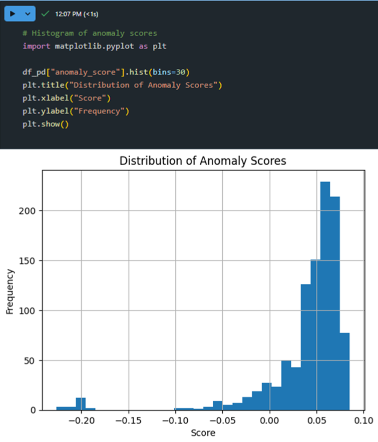

# Kafka → Delta Lake Streaming Pipeline (Databricks)

A real-time, cloud-native data engineering pipeline that ingests, processes, and stores structured event data using Kafka, PySpark, and Delta Lake — purpose-built for portfolio demonstration and Databricks Professional certification prep.

## Project Overview

**Goal:** Build a robust AI-enabled ETL pipeline with Confluent Kafka, Azure Databricks, Delta Lake, and MLflow. This project follows data engineering best practices with a focus on performance, modularity, and cost-aware architecture.


## End-to-End Flow

Confluent Kafka → PySpark Structured Streaming → Bronze Delta Table → Silver Layer → MLflow Inference → Gold Table


**Diagram:** End-to-end architecture of the Kafka-to-Delta streaming pipeline with MLflow integration for batch inference.  
Includes ingestion (Bronze), transformation (Silver), model scoring, and Gold-layer output for monitoring and downstream consumption.


## Architecture

This pipeline simulates a real-time ETL system using:
- Kafka (Confluent Cloud) for streaming ingestion
- PySpark Structured Streaming for real-time processing
- Delta Lake (Databricks) for transactional storage
- Databricks Workflows for orchestration


## Features Implemented (Sprint 1)

- Ingests synthetic events from Confluent Cloud Kafka
- Parses raw Kafka binary payloads into structured JSON
- Writes real-time data to Bronze Delta Table (append mode)
- Uses checkpointing for fault tolerance and replayability
- Kafka credentials redacted using `.env.template` or secrets
- Professionally annotated code with inline documentation

## Workflow Orchestration (Databricks Workflows)

This pipeline is fully orchestrated using [Databricks Workflows](https://docs.databricks.com/workflows/index.html), 
automating the complete flow from Kafka ingestion to data quality monitoring.

Orchestrated Job Name: `full_streaming_pipeline`

It includes the following chained tasks:

1. `01_stream_kafka_to_bronze` – reads real-time events from Kafka and writes to a Delta Bronze table  
2. `02_bronze_to_silver_cleanse` – parses, deduplicates, and optimizes data into the Silver layer  
3. `03_monitor_silver_events` – monitors stream freshness and logs late events for observability

You can also explore the DAG config here: [`jobs/full_streaming_pipeline.json`](jobs/full_streaming_pipeline.json)


File path:

```bash
jobs/full_streaming_pipeline.json
``` 

## Workflow DAG (Databricks Workflows)

This streaming pipeline is orchestrated via Databricks Workflows.

Job: `full_streaming_pipeline`

**Orchestration DAG: Kafka to Delta pipeline via Databricks Workflows**
This DAG executes ingestion → transformation → monitoring with job task chaining.


## Engineering Insights

In addition to building the streaming pipeline, the following enhancements were made to simulate real-world production observability and performance tuning.


## Streaming Observability

This pipeline logs late/stale event metrics to a Delta table called `monitor_logs`.

You can inspect this table using:

```sql
SELECT * FROM monitor_logs ORDER BY run_time DESC
```


**Sample Output: monitor_logs Delta Table**


## Cluster Usage Tracking (Cost Control)

This pipeline logs manual cluster usage into a Delta table called `cluster_logs` for observability and cost awareness.

```sql
SELECT * FROM cluster_logs ORDER BY end_time DESC
```

  
**Sample Output: cluster_logs Delta Table for task-level resource tracking**


## Performance Optimization (Spark UI)

This pipeline was benchmarked and optimized using the Spark UI and physical plans.

**Job-Level Execution Overview**


**Stage-Level Insight: Silver Write Task**


## Write Performance Benchmarking 

This project logs the runtime of key transformations (like Silver writes) to a Delta table called `benchmark_logs`.

```sql
SELECT * FROM benchmark_logs ORDER BY run_time DESC
```


**Sample Output:** `benchmark_logs` table showing runtime duration for the `silver_write` task.


## Spark Physical Plan

This project uses Spark’s physical plan inspection to understand and optimize the Silver layer transformation.

Output of `df_deduped.explain(mode="formatted")` before writing to `silver_events`:


## ML Inference & Anomaly Detection

This stage uses an Isolation Forest model (via `scikit-learn`) to detect anomalies in curated Silver Delta Lake events. Inference results are stored in the Gold layer and visualized.


### Pipeline Highlights

-   Trained `IsolationForest` on features: `value`, `timestamp_unix`

-   Logged model to MLflow (with input signature)

-   Tracked parameters (`contamination`, `features`) and training record count

-   Registered model in MLflow Model Registry

-   Scored over 1,000 Silver events and generated:

    -   `anomaly_score`: continuous score

    -   `anomaly_flag`: binary (`-1` = anomaly, `1` = normal)

-   Wrote results to `gold_anomaly_predictions` Delta table


### MLflow Model Logging

The trained model was logged to MLflow with:

-   Input signature via `input_example`

-   Parameters: contamination rate, feature names

-   Metric: number of training records

-   Registered in MLflow for versioned lifecycle management

**Model Name:** `iforest_silver_anomaly_detector`\
**Version:** 1\
**Registry Scope:** Workspace\
**Owner:** Andrea Hayes



* * * * *


### Inference Results (Gold Layer)

#### Gold Delta Table

  
**Sample Output:** A preview of the `gold_anomaly_predictions` Delta table with anomaly scores and flags.


#### Top Anomaly Query

```sql
SELECT * 
FROM gold_anomaly_predictions 
WHERE anomaly_flag = -1 
ORDER BY anomaly_score ASC 
LIMIT 20
```

  

**Sample Output:** Top 20 most anomalous events scored by the Isolation Forest model.


#### Anomaly Score Distribution

  
**Sample Output:** Distribution of Isolation Forest anomaly scores — left tail indicates flagged outliers.


<pre> 
## Project Structure

kafka-delta-streaming-pipeline/
├── bronze/
│   └── 01_stream_kafka_to_bronze.py    # Kafka → Bronze ingestion logic
├── config/
│   └── .env.template                   # Sample secrets (excluded from Git)
├── data/
│   └── synthetic_data_sample.json      # (Optional) simulated event data
├── docs/
│   └── README_notes.md                 # Design notes and architecture decisions
│   └── architecture.png                # Visual pipeline flow diagram (optional)
├── utils/
│   └── kafka_schema.py                 # Reusable schema and validation functions
├── .gitignore
└── README.md
 </pre>

## Sample Kafka Event

{
  "event_id": "997",
  "event_type": "click",
  "timestamp": "2025-04-01T17:37:57.000Z",
  "value": "1984"
}

## Roadmap

### Sprint 1 (Streaming Pipeline Foundations)
* Kafka cluster + producer simulation
* Bronze ingestion pipeline with Delta
* Silver table with filtering and deduplication
* Delta optimization (ZORDER, partitions)

### Sprint 2–4 (Advanced Layers and Inference)
* MLflow model training and tracking
* Batch inference to Gold layer
* Spark tuning and cost control
* Final repo cleanup, documentation, and demo video

## Cost + Infra Optimization (Sprint 4–5)

To simulate cloud-scale engineering and cost-awareness, this project includes:
- Spot instances + auto-termination on Databricks clusters
- Logging cluster usage to Delta (`cluster_logs`)
- Lightweight benchmarking to track performance (`benchmark_logs`)
- Partitioning + ZORDER to reduce query cost

This mirrors best practices used in production streaming systems.


## Certification Alignment

This project is built to align with the Databricks Certified Data Engineer Professional exam covering:
* Structured Streaming
* Delta Lake intricacies
* Production-level best practices
* Advanced MLflow integration